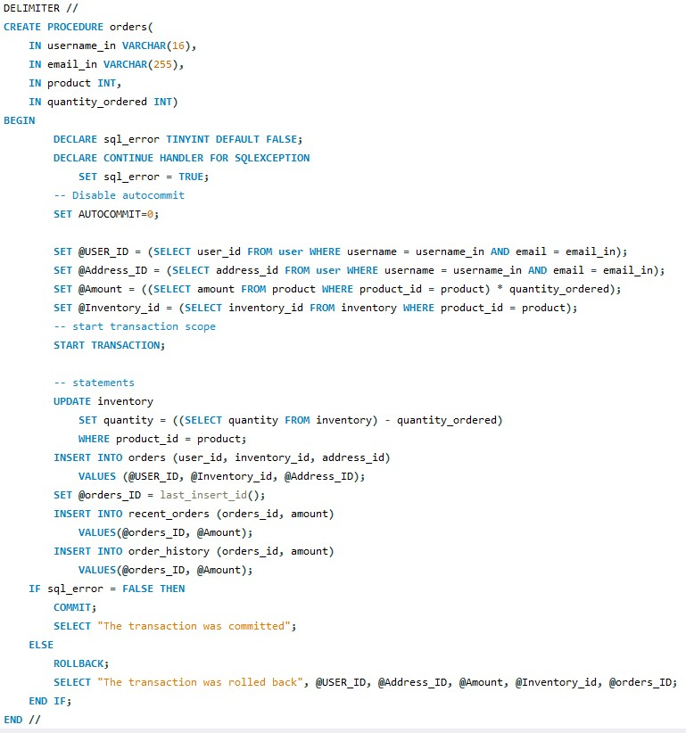
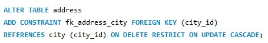
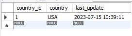
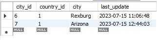

# MySQL-Database

## Purpose

The Purpose of this database design is to store data for a small social media network. The database setup is designed to accommodate for social media users' storage of messages, posts, locations, and any orders they place on the site.
The following sections demonstrate different database functionalities, including inserting, updating, and deleting the database. Primarily we hope to give users insert statements they can use to interact and insert data into tables as simply as possible in the next section a demonstration of this will be shown.
Each section will provide a link to a GitHub repository with better code examples and a basic explanation.

## EER Diagram

## Insert Transactions

In this next section, we demonstrate 4 simple transactions to easily input data into all of the tables. We create insert_data, orders, create_posts, and create_messages transactions which all require different information to be inserted into the transaction. However, once done all the data will be stored in the appropriate tables.

### User / Address Transaction

#### Inputs

- country_name
- city_name
- address
- postalCode
- username
- password
- email
- firstname
- lastname

#### Example call

    call insert_data("USA", "Arizona", "123 Fake Street", "85142", "Taylor", "Password", "taylor@test.com", "Taylor", "Atkin");

### Orders Transaction

#### Inputs

- username_in
- email_in
- product
- quantity_ordered

#### Example call

    CALL orders("Test", "test@byui.edu", 4, 4);

### Posts Transactions

#### Inputs

- username_in
- email_in
- image
- address
- caption_in

#### Example Call

    call create_posts("Test", "test@byui.edu", "img/TEST.png", 4, "HELLO WORLD!");

### Private Messages Transaction

#### Inputs

- user_from
- user_to
- message

#### Example Call

    call create_message(10, 11, "HEY FRIEND!");

## Read / Select Statements

The next section we demonstrate a few different read statements in which you are able to query user information and posts, orders, and direct messages.

### User Info / Posts Query

### Orders Query

### Direct Messages Query

## Update Statements

In the diagram below we can see and example of a constraint placed on the address table. In this constraint we make the primary key of city restricted on deletion and updates in a cascading effect when updated. Constraints like this are added on all tables with foreign keys involved to help ensure data integrity throughout the database.

If the city_id is updated a cascade effect will occur and it will update all of the city_ids in the database. Including in other tables. This helps to ensure that there are no dead cells inside of the database that don’t have a foreign key that references to nothing.

### Update Constraint Example

## Delete Statements

In this database, it is intended to keep data inside of the database with few or limited deletions of data. This is to limit outside potential threats and also help data security, and integrity. If a cell references a deleted cell it will result in an error and corrupt that data. So in order to help prevent this a delete restriction is placed on all foreign keys in order to help limit the amount of deletion and targeting of dead cells that don’t reference correctly.

### Delete Constraint Example

## Simple Table Queries

In this next section queries against all tables will bedemonstrated to give a simple idea of what table columns look like and sample data that can be inserted into the table.

### User Query

    SELECT * FROM user;

### Country Query

    SELECT * FROM country;

### City Query

    SELECT * FROM city;

### Address Query

    SELECT * FROM address;

### Posts Query

    SELECT * FROM posts;

### Messages Query

    SELECT * FROM messages;

### Posts Has User Query

    SELECT * FROM posts_has_user;

### Direct Messages Query

    SELECT * FROM directmessages;

### Inventory Query

    SELECT * FROM inventory;

### Orders Query

    SELECT * FROM orders;

### Recent Orders Query

    SELECT * FROM recent_orders;

### Order History Query

    SELECT * FROM order_history;

### Recent Orders & Order Histroy Queries Disclaimer

There is some data that is missing from recent_orders, and order history. This is a mistake during testing. However, the implementation of the order history works correctly. There was just some data inserted into orders before implementation of these two tables were completed

## Summary

In this database schema, I designed a database to handle most of the information processed by a social media platform and store. It includes tables to store users’ information, addresses, orders, transactions, direct messages, and posts. Additionally, this database is aimed at long-term storage with as little deletion as possible. Constraints are added to each table to limit the deletion of data and cascade updated data to hold data integrity.
